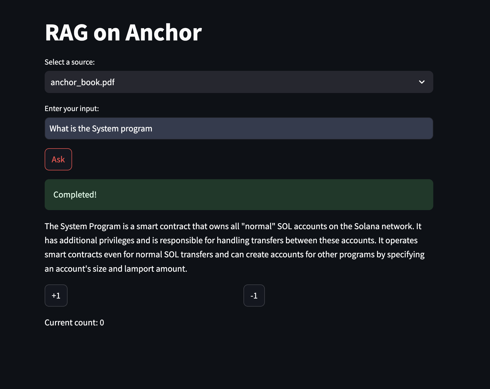
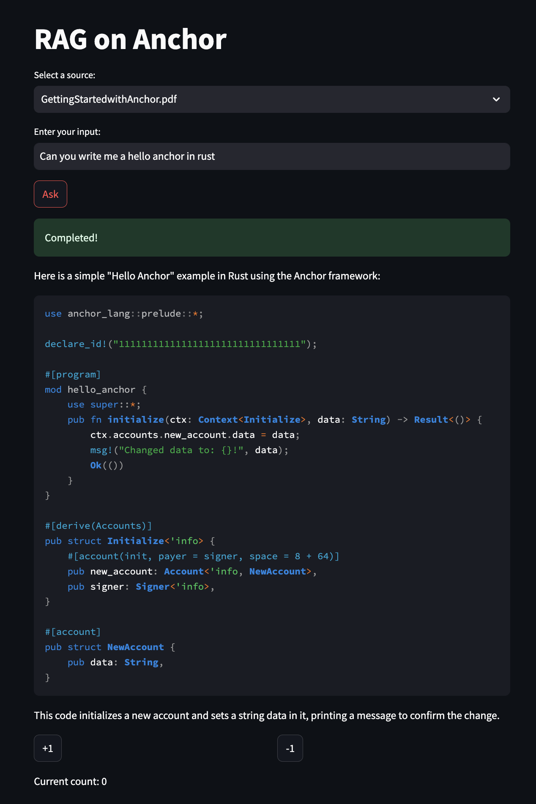

# RAG for Anchor Development Framework


## Overview

This project is part of the final assignment for the LLM - Zoomcamp at Datatalksclub. It involves building a Retrieval-Augmented Generation (RAG) system for the Anchor development framework using two primary resources: `anchor_book.pdf` and `GettingStartedwithAnchor.pdf`. The goal is to facilitate the development of smart contracts on the Solana Blockchain.

## Project Structure

```
llm_project_llama/
├── app.py
├── data_processing/
│   ├── qdrant_loader.py
│   ├── retriever_evaluation.py
├── utils/
│   ├── ground_truth.py
│   ├── rag.py
├── notebooks/
│   ├── llm_project.ipynb
├── assets/
│   ├── ground_truth.json
├── data/
│   ├── anchor_book.pdf
│   ├── GettingStartedwithAnchor.pdf
├── Dockerfile
├── docker-compose.yml
├── requirements.txt
├── upload_data_qdrant.sh
├── .env.project
```

## Features

- **RAG System**: Combines retrieval-based and generation-based approaches to provide accurate and contextually relevant information from the provided PDFs.
- **Smart Contract Development**: Simplifies the process of creating and deploying smart contracts on the Solana Blockchain using the Anchor framework.

## Prerequisites

- **Python 3.11+**
- **Docker** and **Docker Compose** for containerized deployment
- OpenAI API Key [see here](https://platform.openai.com/docs/api-reference/introduction)

## Installation

1. Clone the repository:
   ```sh
   git clone https://github.com/datadudech/llm_project_llama.git
   cd llm_project_llama
   ```
2. Install dependencies:
   ```sh
   pipenv install
   ```
3. Activate the virtual environment:
   ```sh
   pipenv shell
   ```
4. Use `.env.project` and rename it to `.env` and enter the keys for OpenAI

## Usage

### Docker Environment

1. Build the Docker image:
   ```sh
   docker-compose up --build
   ```
2. The Qdrant vector database will be running on `localhost:6333` and the Streamlit app will be accessible on `localhost:8501`.
3. Upload the **pdf** documents, either by script or via the Jupyter notebook
   ```bash
   ./upload_data_qdrant.sh
   ```

### For local environment

1. Run the RAG app:
   ```sh
   streamlit run app.py
   ```
2. Enter your queries and rate the result.
   
3. Or ask for code examples
   

### LLM_Project overview

For detailed information on the project criterias, including RAG flow, Retrieval evaluation, and RAG evaluation, please refer also to the [LLM Project Documentation](notebooks/llm_project.md).

## Resources

- [Anchor Book](data/anchor_book.pdf)
- [Anchor Getting Started](data/GettingStartedwithAnchor.pdf)
- [Ground Truth Anchor Book](assets/ground_truth.json)

## Contributing

Contributions are welcome! Please fork the repository and submit a pull request.

## License

This project is licensed under the MIT License.

## Acknowledgements

- **Datatalksclub**: For providing the [LLM - Zoomcamp](https://datatalks.club/blog/guide-to-free-online-courses-at-datatalks-club.html#llm-zoomcamp) and the [resources](https://github.com/DataTalksClub/llm-zoomcamp) to complete this project.
- **GPT-4o**: For assisting in the creation of this README and providing general information on the Anchor framework and Solana Blockchain.
