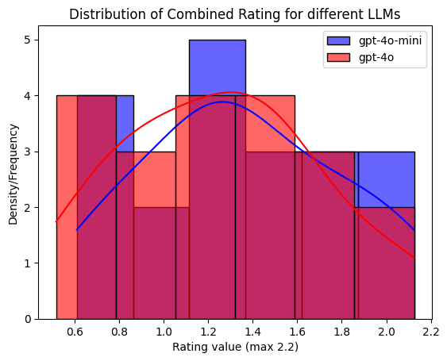
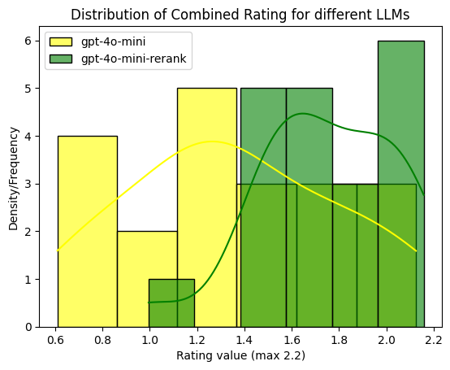

```python
import sys
sys.path.append("..")
import warnings
warnings.filterwarnings('ignore')
```

## Data processing

### Loading documents


```python
from data_processing.qdrant_loader import load_qdrant_client
qdrant_client = load_qdrant_client(host="localhost")
```


```python
from data_processing.qdrant_loader import load_documents, upload_documents_qdrant
documents = load_documents("../data")
```

### Uploading to Qdrant


```python
upload_documents_qdrant(documents=documents, collection_name="anchor", client=qdrant_client)
```

    Fetching 5 files: 100%|██████████| 5/5 [00:00<00:00, 16033.27it/s]


    Documents uploaded to Qdrant


## Retriever Evaluation

### Load Ground truth data


```python
from utils.ground_truth import load_ground_truth
ground_truth = load_ground_truth("../assets/ground_truth.json")

```


```python
from data_processing.retriever_evaluation import evaluate_search_results
from data_processing.qdrant_loader import load_qdrant_client, load_embedding


qdrant_client = load_qdrant_client(host="localhost")
embedding_model = load_embedding()

hit_rate, rate_relevance,_,_ =  evaluate_search_results(ground_truth=ground_truth["questions"], embedding_model=embedding_model, qdrant_client=qdrant_client, verbose=False)

```

    Fetching 5 files: 100%|██████████| 5/5 [00:00<00:00, 52692.26it/s]


    Hit_Rate: 40.00%
    Average Rating: 3.1 / 5
    Average Combined Rating: 1.3565032644569874 / 2.2


## RAG Evaluation


```python

hit_rate, rate_relevance, ratings_4omini, combined_list_4omini  =  evaluate_search_results(ground_truth=ground_truth["questions"],
                                                    llm_model="gpt-4o-mini",
                                                    embedding_model=embedding_model, 
                                                    qdrant_client=qdrant_client, verbose=False)

```

    Hit_Rate: 40.00%
    Average Rating: 3.1 / 5
    Average Combined Rating: 1.3565032644569874 / 2.2


```python
hit_rate, rate_relevance, ratings_4o, combined_list_4o  =  evaluate_search_results(ground_truth=ground_truth["questions"],
                                                    llm_model="gpt-4o",
                                                    embedding_model=embedding_model, 
                                                    qdrant_client=qdrant_client, verbose=False)
```

    Hit_Rate: 40.00%
    Average Rating: 2.75 / 5
    Average Combined Rating: 1.2515032644569872 / 2.2


```python
import seaborn as sns
import matplotlib.pyplot as plt

sns.histplot(combined_list_4omini,  color='blue', label='gpt-4o-mini', kde=True, alpha=0.6)
sns.histplot(combined_list_4o,  color='red', label='gpt-4o', kde=True, alpha=0.6)

plt.xlabel('Rating value (max 2.2)')
plt.ylabel('Density/Frequency')
plt.title('Distribution of Combined Rating for different LLMs')

# Add legend
plt.legend()


```


    <matplotlib.legend.Legend at 0x194981ad0>


    

    


## Re - Ranking


```python
hit_rate, rate_relevance, ratings_4omini_rerank, combined_list_4omini_rerank  =  evaluate_search_results(ground_truth=ground_truth["questions"],
                                                    llm_model="gpt-4o-mini",
                                                    embedding_model=embedding_model, 
                                                    qdrant_client=qdrant_client, verbose=False, n_search_results=5, reranking=True )
```

    Hit_Rate: 45.00%
    Average Rating: 4.3 / 5
    Average Combined Rating: 1.74550478041172 / 2.2


```python
import seaborn as sns
import matplotlib.pyplot as plt

sns.histplot(combined_list_4omini,  color='yellow', label='gpt-4o-mini', kde=True, alpha=0.6)
sns.histplot(combined_list_4omini_rerank,  color='green', label='gpt-4o-mini-rerank', kde=True, alpha=0.6)

plt.xlabel('Rating value (max 2.2)')
plt.ylabel('Density/Frequency')
plt.title('Distribution of Combined Rating for different LLMs')

# Add legend
plt.legend()
```


    <matplotlib.legend.Legend at 0x194db3390>


    

    


## Hybrid Search


```python
from qdrant_client.http.models import Filter, FieldCondition, MatchValue
from utils.ground_truth import extract_text_from_node_content  

filter_conditions = Filter(
            must=[
                FieldCondition(
                    key="file_name",  # The metadata field you want to filter on
                    match=MatchValue(
                        value="GettingStartedwithAnchor.pdf"
                    ),  # The value to match in the 'category' field
                ),
            ]
        )

query = "when was anchor framework guide updated"
query_vector = embedding_model.get_text_embedding(query)

hybrid_search_results = qdrant_client.search(
        collection_name="anchor",
        query_vector=query_vector,
        query_filter=filter_conditions,  # Provide the query vector here
        limit=1,
    )
```


```python
import textwrap

textwrap.fill(extract_text_from_node_content(hybrid_search_results[0].payload), width=70)
```


    "Home>Developers>Guides Getting Started with the Anchor Framework\nupdated 24. April 2024 beginner rust anchor The Anchor framework uses\nRust macros to reduce boilerplate code and simplify the implementation\nof IT'S TIME TO ENTER THE ARENA 📡  - SIGN UP FOR THE SOLANA RADAR\nHACKATHON NOW!"


